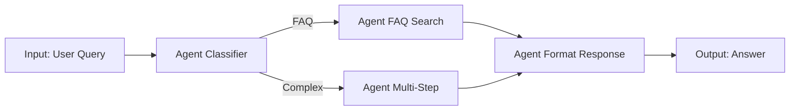

**Agentic workflow là kiến trúc thiết kế quy trình AI tự động bằng chuỗi agent đa bước, mỗi agent đảm nhận một phần công việc với context và công cụ riêng. Thay vì gọi một agent xử lý toàn bộ bài toán phức tạp, workflow chia nhỏ thành các giai đoạn: phân tích → lập kế hoạch → thực thi → kiểm tra → tổng hợp, giúp tăng độ chính xác, dễ debug, và dễ mở rộng hơn single-agent call.**

## Agentic Workflow Là Gì Và Tại Sao Nó Quan Trọng?

Khi bài toán AI phức tạp — chẳng hạn tự động viết báo cáo từ nguồn dữ liệu thô, trả lời câu hỏi đòi hỏi tra cứu nhiều nguồn, hay tự động code và test — việc gọi một agent duy nhất thường dẫn đến hallucination, quên context giữa chừng, hoặc output không nhất quán.

**Agentic workflow** giải quyết bằng cách chia nhỏ:
1. **Agent phân tích**: đọc input, xác định bài toán, trích xuất thông tin cần thiết.
2. **Agent lập kế hoạch**: thiết kế chiến lược giải quyết, chia nhỏ thành các subtask.
3. **Agent thực thi**: chạy từng subtask với công cụ (tool) phù hợp — search web, gọi API, query database, đọc file.
4. **Agent kiểm tra**: verify kết quả từng bước, phát hiện lỗi sớm.
5. **Agent tổng hợp**: gộp output thành câu trả lời cuối hoặc deliverable.

Mỗi agent chỉ thấy context cần thiết cho giai đoạn của nó, giảm thiểu token waste và tăng tính tập trung. Khi một bước lỗi, workflow có thể retry chỉ bước đó thay vì chạy lại toàn bộ.

## Kiến Trúc Agentic Workflow: Các Mô Hình Phổ Biến

### 1. Linear Workflow (Tuyến Tính)

Mô hình đơn giản nhất: agent chạy tuần tự từng bước, output của bước N là input của bước N+1.

**Ví dụ**: Pipeline tạo blog post
```
Agent 1 (Research)    → tìm kiếm keyword, top 3 competitor
Agent 2 (Outline)     → tạo đề cương từ research
Agent 3 (Draft)       → viết nội dung từ outline
Agent 4 (SEO Check)   → kiểm tra title/meta/heading
Agent 5 (Publish)     → deploy lên CMS
```

**Ưu điểm**: dễ debug, rõ ràng, phù hợp quy trình có sẵn.  
**Nhược điểm**: không linh hoạt, không xử lý được logic rẽ nhánh.

### 2. Branching Workflow (Phân Nhánh)

Workflow có điều kiện: agent quyết định bước tiếp theo dựa vào kết quả hiện tại.

**Ví dụ**: Trả lời câu hỏi khách hàng
```
Agent Classifier → phân loại câu hỏi (technical / billing / general)
  ├─ technical  → Agent Tech Support → tra tài liệu kỹ thuật
  ├─ billing    → Agent Billing      → query database invoice
  └─ general    → Agent FAQ          → semantic search knowledge base
Agent Synthesis → tổng hợp câu trả lời từ agent chuyên môn
```

**Ưu điểm**: linh hoạt, tối ưu chi phí (chỉ chạy agent cần thiết).  
**Nhược điểm**: phức tạp hơn về logic điều kiện.

### 3. Parallel Workflow (Song Song)

Nhiều agent chạy đồng thời xử lý các subtask độc lập, sau đó gộp kết quả.

**Ví dụ**: Phân tích cạnh tranh toàn diện
```
[ Agent 1: web search top 5 đối thủ ]
[ Agent 2: crawl pricing page         ]  →  Agent Merge  →  Report
[ Agent 3: phân tích SEO keyword      ]
[ Agent 4: đọc reviews khách hàng     ]
```

Tất cả 4 agent chạy song song, Agent Merge đợi cả 4 xong rồi tổng hợp.

**Ưu điểm**: nhanh (giảm latency tổng), tận dụng concurrency.  
**Nhược điểm**: cần quản lý state/error phức tạp hơn.

### 4. Loop Workflow (Lặp)

Agent lặp lại một bước cho đến khi đạt điều kiện dừng (giới hạn vòng lặp hoặc chất lượng output đạt ngưỡng).

**Ví dụ**: Code generation với test-driven loop
```
Agent Code    → sinh code từ spec
Agent Test    → chạy unit test
  ├─ PASS → break
  └─ FAIL → Agent Fix → sửa lỗi → loop lại (max 3 lần)
```

**Ưu điểm**: tự sửa lỗi, tăng độ chính xác.  
**Nhược điểm**: có thể vòng lặp vô hạn nếu không set max iterations.

## Thiết Kế Agentic Workflow Thực Tế: 7 Bước

### Bước 1: Phân Tích Bài Toán

Xác định rõ input, output mong muốn, và constraint (thời gian, chi phí token, độ chính xác).

**Câu hỏi then chốt**:
- Bài toán có thể chia nhỏ thành bao nhiêu giai đoạn rõ ràng?
- Giai đoạn nào cần công cụ bên ngoài (tool/API)?
- Giai đoạn nào cần context dài, giai đoạn nào chỉ cần snippet ngắn?

### Bước 2: Vẽ Sơ Đồ Workflow

Dùng flowchart (Mermaid, Lucidchart, hoặc giấy) để visual hóa:
- Hình chữ nhật = agent/bước
- Mũi tên = luồng data
- Hình thoi = điều kiện rẽ nhánh
- Đường song song = concurrent tasks



### Bước 3: Chọn Kiến Trúc Agent

Mỗi agent trong workflow cần:
- **System prompt** rõ vai trò (chỉ làm một việc, không lan man)
- **Tools**: danh sách function/API được phép gọi
- **Context window**: kế thừa từ bước trước (toàn bộ hoặc summary)
- **Model**: có thể dùng model khác nhau cho agent khác nhau (ví dụ GPT-4 cho lập kế hoạch, GPT-3.5-turbo cho format output)

**Pattern phổ biến**:
- **ReAct Agent** (Reasoning + Acting): agent tự suy luận và quyết định tool nào cần gọi.
- **Function-Calling Agent**: agent gọi tool theo schema định sẵn, không tự do suy luận.
- **Human-in-the-Loop Agent**: dừng lại chờ con người approve trước khi tiếp tục (dùng cho bước nhạy cảm như publish/payment).

### Bước 4: Quản Lý State Giữa Các Bước

Workflow cần lưu trạng thái giữa các agent. Các lựa chọn:

**In-memory** (Redis, dict object): nhanh nhưng mất khi crash.  
**Database** (PostgreSQL, MongoDB): bền vững, query được, phù hợp production.  
**Message queue** (RabbitMQ, Kafka): phân tán, scale tốt cho parallel workflow.

Dữ liệu truyền giữa agent thường là:
```json
{
  "workflow_id": "wf-12345",
  "current_step": 2,
  "context": {
    "user_query": "...",
    "research_output": "...",
    "outline": "..."
  },
  "metadata": {
    "started_at": "2026-09-14T09:00:00Z",
    "user_id": "usr-789"
  }
}
```

### Bước 5: Xử Lý Lỗi Và Retry

Mỗi bước có thể lỗi (API timeout, hallucination, rate limit). Thiết kế resilience:

- **Retry with exponential backoff**: thử lại tối đa 3 lần, mỗi lần chờ lâu hơn.
- **Fallback agent**: nếu agent chính lỗi, chuyển sang agent dự phòng (model khác hoặc logic đơn giản hơn).
- **Circuit breaker**: nếu một bước lỗi quá nhiều lần, tạm dừng workflow và alert.
- **Graceful degradation**: trả về kết quả partial thay vì fail hoàn toàn.

**Ví dụ**:
```python
def run_agent_with_retry(agent, input_data, max_retries=3):
    for attempt in range(max_retries):
        try:
            return agent.run(input_data)
        except Exception as e:
            if attempt == max_retries - 1:
                raise
            time.sleep(2 ** attempt)  # exponential backoff
```

### Bước 6: Observability — Log, Trace, Monitor

Workflow phức tạp khó debug. Cần:

**Logging từng bước**: input, output, latency, token sử dụng.  
**Trace ID**: gắn UUID duy nhất cho mỗi workflow run, log tất cả bước với cùng trace ID.  
**Observability tool**: LangSmith, Helicone, Weights & Biases — replay workflow, so sánh version, phát hiện bottleneck.

**Metric quan trọng**:
- Success rate từng bước
- P95 latency (thời gian 95% request hoàn thành)
- Token cost per workflow
- Error type distribution (hallucination / timeout / tool failure)

### Bước 7: Deploy Production Với Orchestration Framework

Viết workflow bằng tay (if-else + function call) work cho POC, nhưng không scale. Dùng framework:

**LangGraph** (LangChain): define workflow bằng graph Python, built-in state management.  
**AutoGen** (Microsoft): multi-agent conversation framework.  
**Semantic Kernel** (Microsoft): orchestration cho C#/Python.  
**Custom với Temporal/Prefect**: nếu cần kiểm soát hoàn toàn, dùng workflow engine như Temporal (scale tốt, durable execution).

**Ví dụ LangGraph**:
```python
from langgraph.graph import StateGraph

workflow = StateGraph()
workflow.add_node("research", research_agent)
workflow.add_node("outline", outline_agent)
workflow.add_node("draft", draft_agent)
workflow.add_edge("research", "outline")
workflow.add_edge("outline", "draft")

app = workflow.compile()
result = app.invoke({"query": "Viết về AI safety"})
```

## Best Practices: Kinh Nghiệm Thực Chiến

### 1. Bắt Đầu Đơn Giản, Thêm Phức Tạp Dần

Workflow đầu tiên nên là linear 2-3 bước. Khi chạy ổn mới thêm branching/parallel. Quá phức tạp ngay từ đầu = debug hell.

### 2. Giữ Mỗi Agent Chỉ Làm Một Việc

Agent "làm tất cả" = context quá dài + hallucination cao. Tách nhỏ: một agent chỉ search, một agent chỉ summarize, một agent chỉ format.

### 3. Đặt Giới Hạn Rõ Ràng

- Max tokens per agent (tránh output quá dài)
- Max loop iterations (tránh vòng lặp vô hạn)
- Timeout per step (tránh agent chạy mãi)

### 4. Test Từng Agent Riêng Trước Khi Ghép

Unit test từng agent với input/output mẫu. Đảm bảo agent hoạt động đúng standalone trước khi chạy workflow.

### 5. Human-in-the-Loop Cho Bước Nhạy Cảm

Với workflow liên quan đến tiền (thanh toán, hoàn tiền) hoặc dữ liệu nhạy cảm (xóa data, public post), thêm bước xác nhận con người.

### 6. Version Workflow Như Code

Lưu workflow definition trong Git. Khi thay đổi, tag version và test regression trước khi deploy production.

## So Sánh: Khi Nào Dùng Agentic Workflow vs Single Agent?

| Tình huống | Single Agent | Agentic Workflow |
|------------|--------------|------------------|
| Tác vụ đơn giản, 1-2 bước | ✅ Dùng single agent (nhanh, rẻ) | ❌ Overkill |
| Cần tra cứu nhiều nguồn khác nhau | ❌ Dễ miss context | ✅ Mỗi nguồn một agent |
| Bài toán có logic rẽ nhánh | ❌ Agent dễ nhầm lẫn | ✅ Workflow branching |
| Output cần chất lượng cao, ít hallucination | ❌ Single agent dễ sai | ✅ Agent kiểm tra riêng |
| Cần scale xử lý nhiều request song song | ❌ Bottleneck | ✅ Parallel workflow |
| Debug và maintain lâu dài | ❌ Khó trace | ✅ Log từng bước rõ ràng |

## Ví Dụ Thực Tế: Workflow Tự Động Trả Lời Email Support

**Bài toán**: Hệ thống nhận 1000+ email support/ngày, cần tự động trả lời 70% câu hỏi thường gặp, escalate 30% còn lại cho con người.

**Workflow thiết kế**:
```
1. Agent Email Parser
   - Input: raw email (subject + body)
   - Output: structured { category, urgency, key_points }

2. Agent Knowledge Search
   - Input: key_points
   - Tool: semantic search trong knowledge base (vector DB)
   - Output: top 3 relevant articles

3. Agent Draft Response
   - Input: email context + relevant articles
   - Output: draft reply

4. Agent Quality Check
   - Input: draft reply
   - Tool: hallucination detector, tone analyzer
   - Output: PASS / FAIL + confidence score

5. Agent Decision (branching)
   - If confidence > 0.85 → auto-send reply
   - Else → route to human agent queue
```

**Kết quả thực tế** (startup SaaS thực tế tại Việt Nam):
- Automation rate: 68% email tự động trả lời đúng
- Avg response time: từ 4 giờ xuống 2 phút
- Cost: giảm 40% headcount support team
- Customer satisfaction: tăng từ 3.2/5 lên 4.1/5 (vì reply nhanh hơn)

## Tools & Frameworks Đề Xuất

**Orchestration**:
- [LangGraph](https://github.com/langchain-ai/langgraph) — Python, tích hợp sẵn LangChain
- [AutoGen](https://github.com/microsoft/autogen) — multi-agent conversation
- [CrewAI](https://github.com/joaomdmoura/crewai) — role-based agents
- [Temporal](https://temporal.io) — durable workflow engine (không AI-specific nhưng rất mạnh)

**Observability**:
- [LangSmith](https://www.langchain.com/langsmith) — trace, debug, evaluate
- [Helicone](https://www.helicone.ai) — monitoring, cost tracking
- [Weights & Biases](https://wandb.ai) — experiment tracking

**State Management**:
- Redis (in-memory, nhanh)
- PostgreSQL + JSON column (bền vững)
- DynamoDB (nếu trên AWS)

## Tương Lai Của Agentic Workflow

Xu hướng đang nổi:

**1. Multi-modal workflow**: agent xử lý cả text, image, audio, video trong cùng một workflow (ví dụ: agent phân tích video → tạo transcript → tóm tắt → sinh thumbnail).

**2. Self-improving workflow**: workflow tự thu thập feedback từ user, fine-tune agent hoặc điều chỉnh routing logic theo thời gian.

**3. Federated agent network**: nhiều tổ chức share agent qua API, workflow gọi agent của đối tác khi cần expertise domain riêng.

**4. Low-code workflow builder**: tool no-code/low-code cho non-technical user tự thiết kế workflow bằng drag-drop (giống Zapier nhưng cho agent AI).

---

**Đọc thêm:**

- [Agent AI Tự Động: Thiết Kế Và Triển Khai Thực Tế](/blog/agent-ai-tu-dong-thiet-ke-trien-khai/) — Hướng dẫn xây dựng agent AI từ đầu với ReAct pattern, tool calling và production deployment.
- [Prompt Engineering Nâng Cao: Kỹ Thuật Tối Ưu Giao Tiếp Với AI](/blog/prompt-engineering-nang-cao-ky-thuat-toi-uu/) — Kỹ thuật viết prompt hiệu quả cho từng agent trong workflow, giảm hallucination và tăng chất lượng output.
- [AI Observability: Giám Sát Và Debug LLM Apps](/blog/ai-observability-giam-sat-debug-llm-apps/) — Công cụ và phương pháp theo dõi workflow production, trace lỗi và tối ưu chi phí token.
